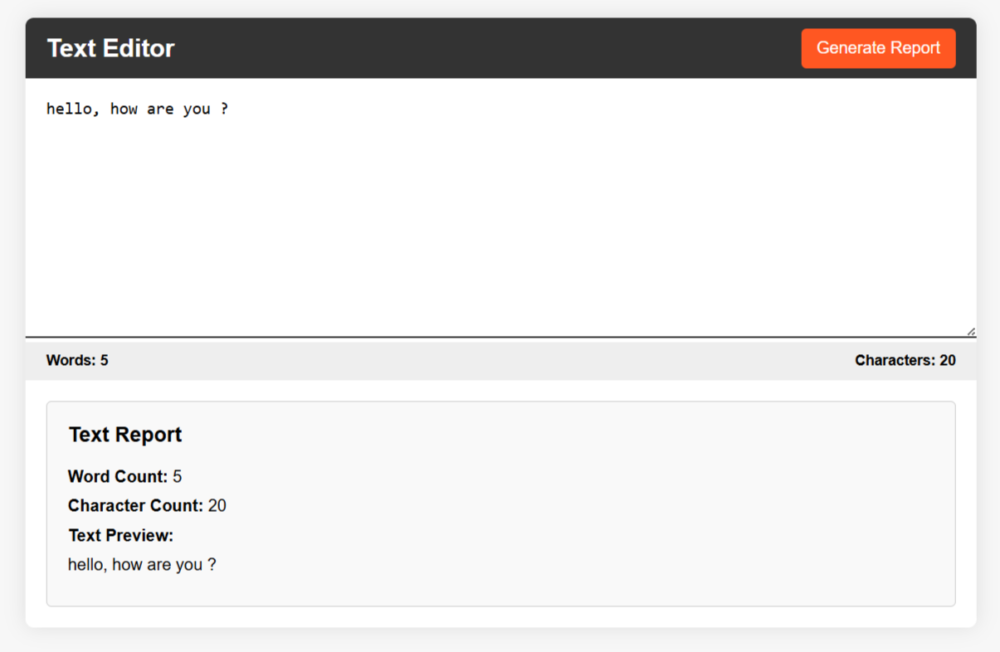

# 📝 Text Editor & Report Generator

A simple and practical **Text Editor Web App** built using **HTML, CSS, and JavaScript**, designed to provide real-time text insights like word count, character count, and a quick report view.

This project focuses on clean UI and basic text processing using core JavaScript concepts.

---

## 🔗 Live Demo

https://text-editor-hkaur.vercel.app

---

## 📌 Features

* Write or paste text in a clean editor
* Real-time **word count**
* Live **character count** (including spaces)
* Generate a structured **text report**
* Preview entered text instantly
* Fast and responsive interface

---

## 🛠️ Tech Stack

* HTML
* CSS
* JavaScript
* Browser DOM & Event Handling

---

## 📷 Screenshot

---

## ⚙️ How It Works

* The app listens for input changes in the text area
* It calculates:

  * Word count using text splitting
  * Character count dynamically
* On clicking **"Generate Report"**, it displays:

  * Word count
  * Character count
  * Text preview

---

